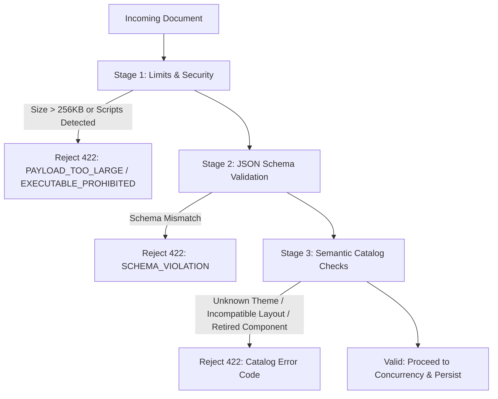

# ARC-08 §11 — Customization Validation Pipeline

```mermaid
flowchart TD
    Req[Incoming Document] --> Stage1[Stage 1: Limits & Security]
    Stage1 -- Size > 256KB or Scripts Detected --> Reject1[Reject 422: PAYLOAD_TOO_LARGE / EXECUTABLE_PROHIBITED]
    Stage1 --> Stage2[Stage 2: JSON Schema Validation]
    Stage2 -- Schema Mismatch --> Reject2[Reject 422: SCHEMA_VIOLATION]
    Stage2 --> Stage3[Stage 3: Semantic Catalog Checks]
    Stage3 -- Unknown Theme / Incompatible Layout / Retired Component --> Reject3[Reject 422: Catalog Error Code]
    Stage3 --> Pass[Valid: Proceed to Concurrency & Persist]
```

All validation errors are formatted in RFC 7807 / RFC 9457 structured problem details with precise JSON paths and error codes.
