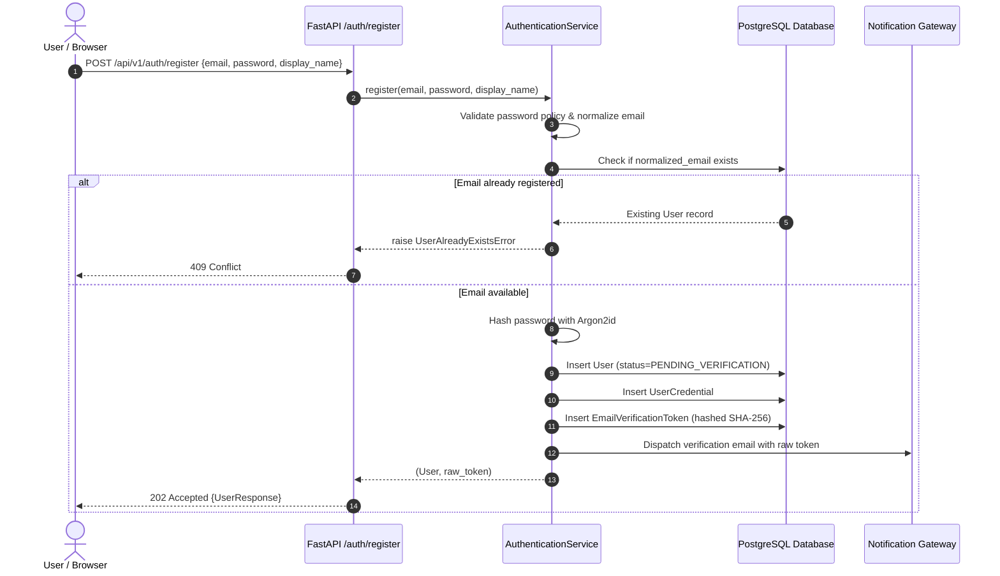
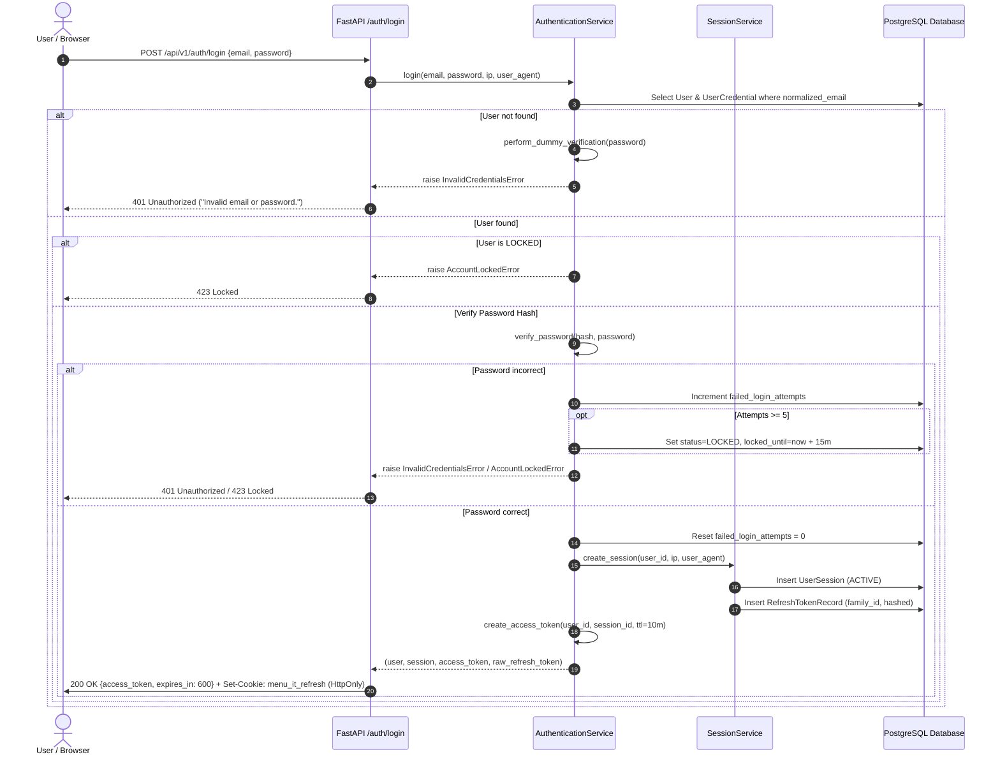

# FCD-05 — Authentication Flows

## 1. User Registration Flow

```mermaid
sequenceDiagram
    autonumber
    actor Client as User / Browser
    participant API as FastAPI /auth/register
    participant AuthSvc as AuthenticationService
    participant DB as PostgreSQL Database
    participant Email as Notification Gateway

    Client->>API: POST /api/v1/auth/register {email, password, display_name}
    API->>AuthSvc: register(email, password, display_name)
    AuthSvc->>AuthSvc: Validate password policy & normalize email
    AuthSvc->>DB: Check if normalized_email exists
    alt Email already registered
        DB-->>AuthSvc: Existing User record
        AuthSvc-->>API: raise UserAlreadyExistsError
        API-->>Client: 409 Conflict
    else Email available
        AuthSvc->>AuthSvc: Hash password with Argon2id
        AuthSvc->>DB: Insert User (status=PENDING_VERIFICATION)
        AuthSvc->>DB: Insert UserCredential
        AuthSvc->>DB: Insert EmailVerificationToken (hashed SHA-256)
        AuthSvc->>Email: Dispatch verification email with raw token
        AuthSvc-->>API: (User, raw_token)
        API-->>Client: 202 Accepted {UserResponse}
    end
```

---

## 2. User Login Flow

```mermaid
sequenceDiagram
    autonumber
    actor Client as User / Browser
    participant API as FastAPI /auth/login
    participant AuthSvc as AuthenticationService
    participant SessSvc as SessionService
    participant DB as PostgreSQL Database

    Client->>API: POST /api/v1/auth/login {email, password}
    API->>AuthSvc: login(email, password, ip, user_agent)
    AuthSvc->>DB: Select User & UserCredential where normalized_email
    alt User not found
        AuthSvc->>AuthSvc: perform_dummy_verification(password)
        AuthSvc-->>API: raise InvalidCredentialsError
        API-->>Client: 401 Unauthorized ("Invalid email or password.")
    else User found
        alt User is LOCKED
            AuthSvc-->>API: raise AccountLockedError
            API-->>Client: 423 Locked
        else Verify Password Hash
            AuthSvc->>AuthSvc: verify_password(hash, password)
            alt Password incorrect
                AuthSvc->>DB: Increment failed_login_attempts
                opt Attempts >= 5
                    AuthSvc->>DB: Set status=LOCKED, locked_until=now + 15m
                end
                AuthSvc-->>API: raise InvalidCredentialsError / AccountLockedError
                API-->>Client: 401 Unauthorized / 423 Locked
            else Password correct
                AuthSvc->>DB: Reset failed_login_attempts = 0
                AuthSvc->>SessSvc: create_session(user_id, ip, user_agent)
                SessSvc->>DB: Insert UserSession (ACTIVE)
                SessSvc->>DB: Insert RefreshTokenRecord (family_id, hashed)
                AuthSvc->>AuthSvc: create_access_token(user_id, session_id, ttl=10m)
                AuthSvc-->>API: (user, session, access_token, raw_refresh_token)
                API->>Client: 200 OK {access_token, expires_in: 600} + Set-Cookie: menu_it_refresh (HttpOnly)
            end
        end
    end
```
